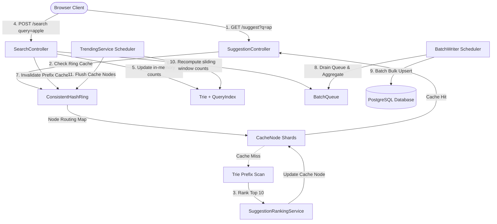

# Search Typeahead System

A real-time search suggestion system backed by an AOL query log dataset (~1.24M unique queries), featuring:

- **In-memory Trie + HashMap index** for sub-millisecond prefix lookup
- **Distributed cache** with hand-rolled consistent hashing (3 virtual-node shards)
- **Trending ranking** using a 7-day sliding window + weighted scoring (0.3 overall / 0.7 recent)
- **Batch writes** to PostgreSQL — aggregated, periodic flush to minimize DB write pressure
- **React + Vite + TailwindCSS** frontend with debounced typeahead, keyboard navigation, and a cache-debug inspector

---

## Prerequisites

| Tool | Required version |
|---|---|
| Java | 21+ |
| Maven | 3.8+ |
| Node.js | 18+ |
| Python | 3.10+ (for preprocessing only) |
| PostgreSQL | Hosted on Supabase (credentials in `.env`) |

---

## First-Time Setup

### 1. Clone & enter the repo

```bash
git clone <repo-url>
cd TypeAhead-HLD
```

### 2. Set environment variables

```bash
cp .env.example .env
# Edit .env — fill in your SUPABASE_DB_URL, SUPABASE_DB_USER, SUPABASE_DB_PASSWORD
```

### 3. Preprocess the dataset (one-time)

```bash
cd dataset
python3 preprocess.py
# Produces: dataset/processed/queries.csv (~1.24M rows)
cd ..
```

### 4. Install frontend dependencies

```bash
cd frontend && npm install && cd ..
```

---

## Running Locally

Open **two terminals**:

**Terminal 1 — Backend** (Spring Boot on :8080):
```bash
cd backend
export $(cat ../.env | xargs)   # load env vars
mvn spring-boot:run
```

**Terminal 2 — Frontend** (Vite on :5173):
```bash
cd frontend
npm run dev
```

Open **http://localhost:5173** in your browser.

> The backend loads the dataset at startup (~30–90 seconds depending on hardware).
> The health check endpoint `GET http://localhost:8080/actuator/health` returns `{"status":"UP"}` once ready.

---

## API Reference

| Method | Path | Description |
|---|---|---|
| `GET` | `/suggest?q=<prefix>` | Up to 10 ranked suggestions |
| `POST` | `/search` | Submit a query, returns `{"message":"Searched"}` |
| `GET` | `/cache/debug?prefix=<prefix>` | Per-prefix cache routing info |
| `GET` | `/cache/debug` | Aggregate cache stats |
| `GET` | `/actuator/health` | App health |
| `GET` | `/swagger-ui.html` | Interactive API docs |

---

## Architecture

The system follows a highly optimized, read-heavy distributed layout:



### Key Components

* **ConsistentHashRing:** Maps incoming search prefixes to physical cache nodes using 32-bit MurmurHash3. Features 150 virtual nodes per physical node to prevent key skew.
* **CacheNode Shards:** Multi-instance isolated caches holding prefix-to-suggestion entries.
* **Trie + QueryIndex:** Memory-resident indexes enabling fast string prefix scanning ($O(L)$ where $L$ is query length) and lookup.
* **BatchQueue + BatchWriter:** Decouples search persistence, collapsing thousands of concurrent SQL updates into high-performance bulk-upserts.
* **TrendingService:** Automatically updates counts within a sliding window (7-day window) to prioritize fresh, trending queries.

---

## Dataset

- **Source:** AOL Search Query Log (`user-ct-test-collection-02.txt`)
- **Size:** 3.6M rows, ~1.24M unique queries
- **Format:** Tab-separated; preprocessing aggregates by query to produce `query,count,lastSeen` CSV
- **Used unfiltered** (deliberate — real search log data; see DESIGN.md §9.1)

---

## Performance Targets

| Metric | Target |
|---|---|
| Suggestion latency (cache hit) | p95 < 50ms |
| Suggestion latency (cache miss) | p95 < 150ms |
| Search submission latency | p95 < 100ms |
| Cache hit rate | > 80% |
| DB write reduction via batching | > 70% |

See `PERFORMANCE.md` for actual measured results.
